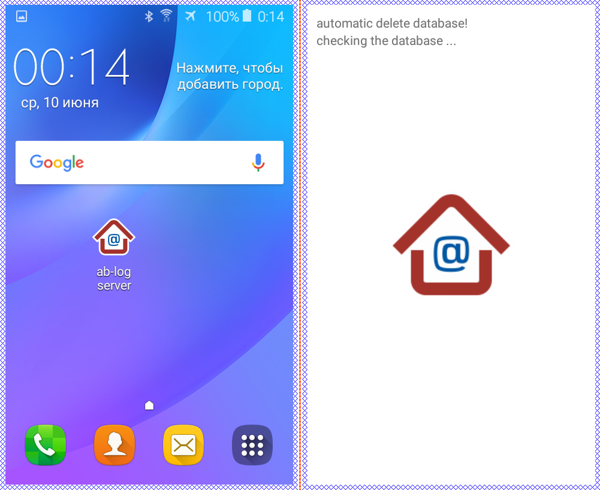
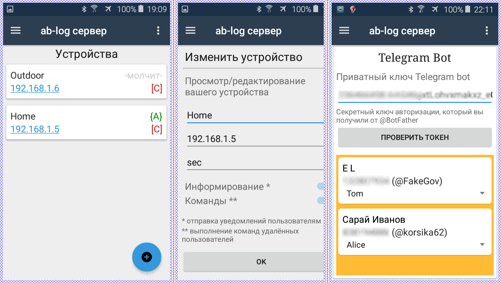
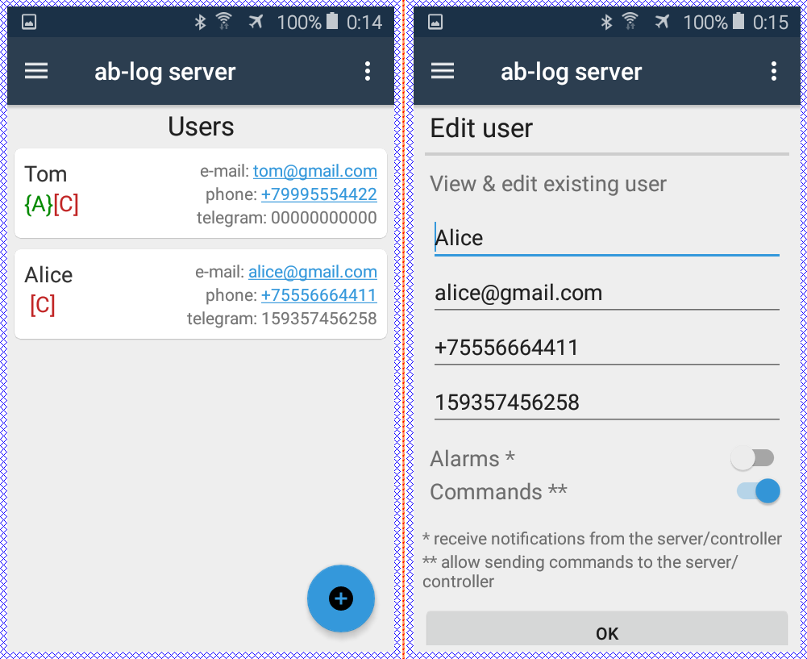
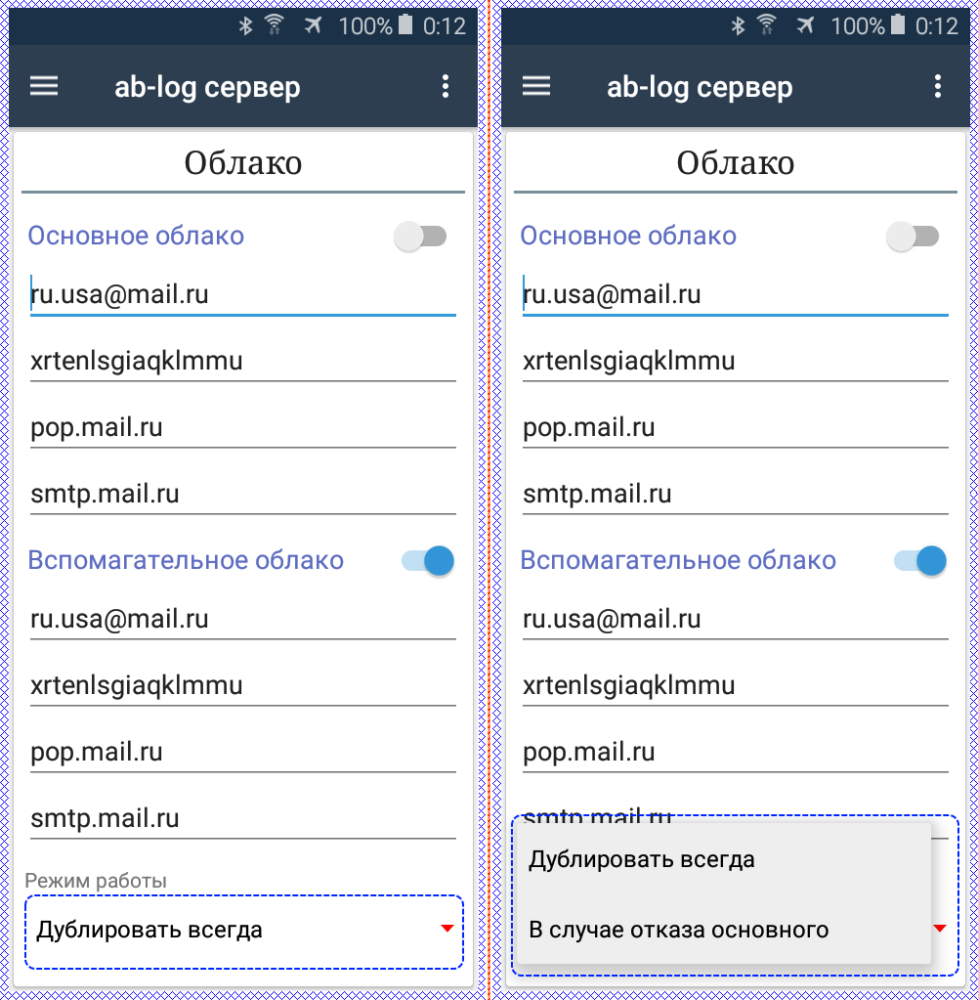

# ab-log-app
~ старт разработки НЕОФИЦИАЛЬНОГО приложения для удалённого управления контроллерами "умного дома".
По достижении статуса приложения пригодного для массового тестирования - [на форуме](https://ab-log.ru/forum/) производителя контроллеров от [моего имени](https://www.ab-log.ru/forum/search.php?author_id=7152&sr=posts) будет опубликована соответствующая запись.

Особенности:
- приложение выступает в роли микро-сервера на базе OS Android. Таким образом любой смартфон с Android версии от 5.0 и выше сможет выполнять роль HTTP сервера для обработки вызовов от управляющих контроллеров и иметь GUI для настройки оборудования и т.д.
- микро-сервер на базе смартфона сразу имеет слот для симки (рассылка уведомлений и получение команд через смс или мобильный интернет), wi-fi и собственный сенсорный дисплей. У подобного сервера есть масса и других преимуществ: низкая цена устройства, встроенный аккумулятор, мобильность и т.д.
- сопряжённое управляющее оборудование используется производителя [ab-log.ru](https://ab-log.ru/), но простота и открытость протокола HTTP позволяет минимальными усилиями модифицировать ПО под другое оборудование.
- хранение настроек (и прочих данных) в облаке. облачное хранилище будет реализовано "поверх почтовых протоколов" (SMTP/POP3/IMAP). Таким образом хранение данных будет бесплатным и доступным любому пользователю. достаточно иметь почтовый ящик. На деле желательно иметь два разных почтовых акаунта на разных серверах (например mail.ru и yandex.ru). Таким образом будет достигаться отказоустойчивость и ап-тайм близкий к 100%.
- удалённый доступ к управлению портами, настройками и рассылка уведомлений через SMS/Intenet/TelegramBot. В то время как администратор имеет доступ к низкоуровневой конфигурации сервера и контроллеров, "удалённые пользователи" в зависимости от настроек имеют доступ непосредственно к выходным портами (вкл/выкл оборудования) и/или получение уведомлений от входных портов (датчики) через SMS/Telegram/E-mail. Ни что не мешает "по событию" выполнить дозвон с серверного смартфона на администраторский номер.

 > Специфика обмена данными (команды, ответы, уведомления и т.д.) такова, что в роли транспорта будут использоваться посредники Email/Telegram/SMS.
Это полностью избавляет пользователя от необходимости иметь выделенный IP адрес или аренды хостинга.
При посредничестве пассивных сторонних серверов данные без проблем достигнут адресатов, но вместе с этим такой подход несёт один важный недостаток: скорость отклика.
Текущее решение не предусматривает высокой скорости отклика, а нацелено на отказоустойчивость и низкую/нулевую цену.
Другими словами данная система не способна отвечать мгновенно. В системах "реального времени реагирования" следует использовать иные подходы и должны размещаться на выделенных серверах (хостинг или сосбвтенные), но это уже совсем другая история.
Текущее решение не претендует на звание 'промышленного', а для личных нужд прекрасно справится с задачей.

