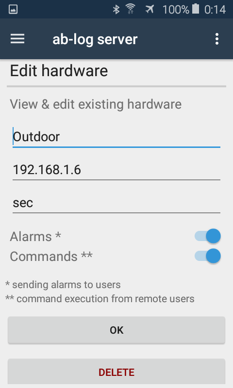
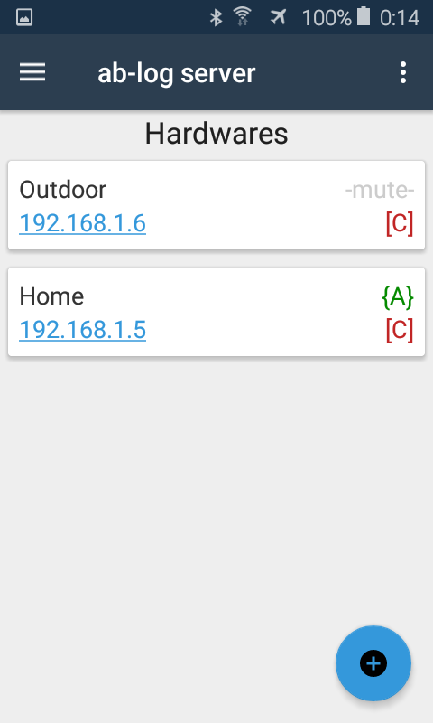
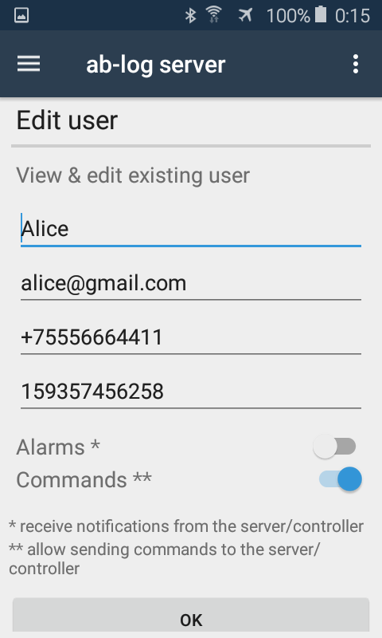
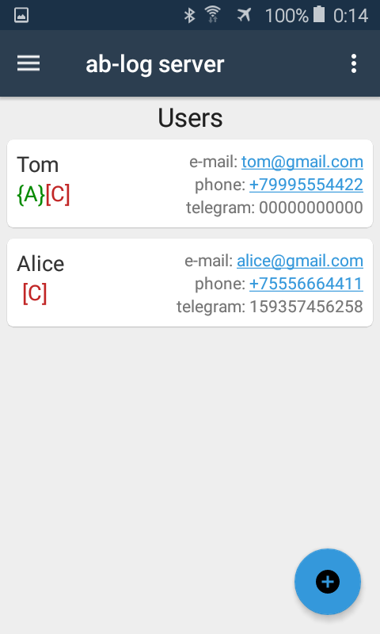

# ab-log-app
~
старт разработки приложения для удалённого управления контроллерами "умного дома".

Особенности:
- приложение выступает в роли микро-сервера на базе OS Android. Таким образом любой смартфон с Android версии от 5.0 и выше сможет выполнять роль HTTP сервера (для обработки вызовов от управляющих контроллеров), настройки оборудования и т.д.
- микро-сервер на базе смартфона сервер сразу имеет слот для симки (рассылка уведомлений и получение команд через смс или мобильныйинтернет), wi-fi и собственное сенсорное управленние (+ по сути собственный монитор). У подобного сервера есть масса и других приимуществ: низкая цена устройства, встроеный аккамулятор, мобильность и т.д.
- сопряжённое управляющее оборудование используется производителя https://ab-log.ru/, но простота и открытость протокоа HTTP позволяет минимальными усилиями модифицировать ПО под другое оборудование.
- хранение настроек (и прочих данных) в облаке. облачное хранилище будет реализовано на базе почтовых протоколов (SMTP/POP3/IMAP). Таким образом хранение данных будет бесплатным и доступным любому пользователю. достаточно иметь почтовый ящик. На деле желательно иметь два разных почтовых акаунта на разных серверах (например mail.ru и yandex.ru). Таким образом будет достигаться отказоустойчивость и ап-тайм близкий к 100%.
- удалённый доступ к управлению портами, настройками и рассылка уведомлений через SMS/Intenet/TelegramBot. В товремя как владелец облака (e-mail cloud) имеет доступ к низкоуровневой конфигурации системы, "удалённые пользователи" в зависимости от настроек имеют доступ к управлению непосредственно портами (вкл/выкл оборудования) и/или получение уведомлений через SMS/Telegram/E-mail и теоретически даже Phone. Настройки задаёт владелец облака, а удалённые пользователи имеют доступ к удалённой эксплуатации.

