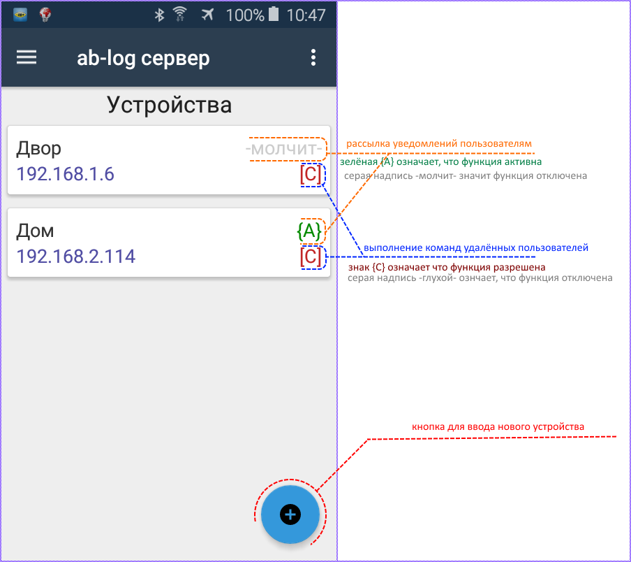
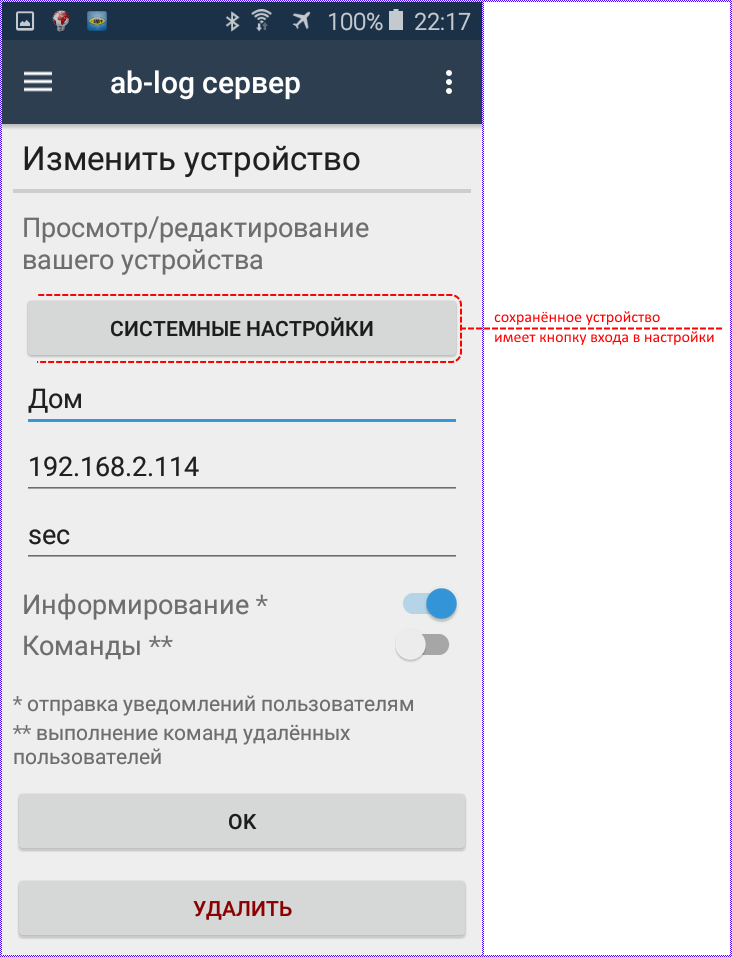
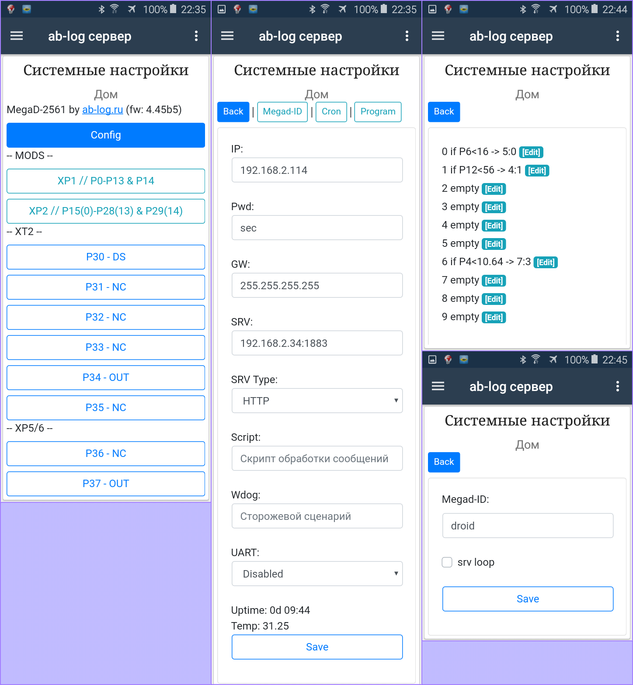
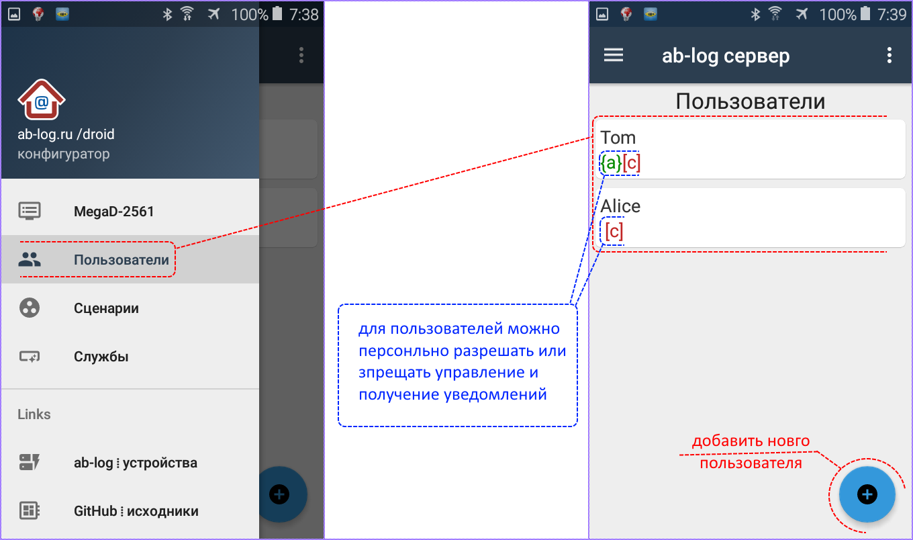
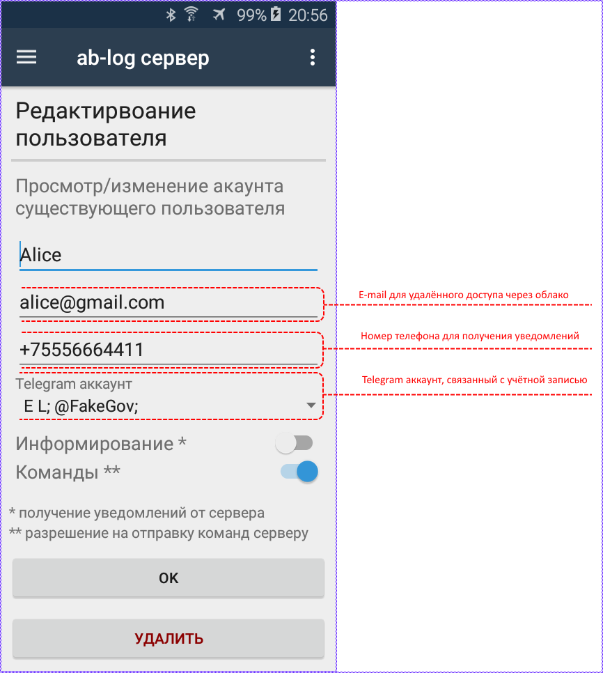
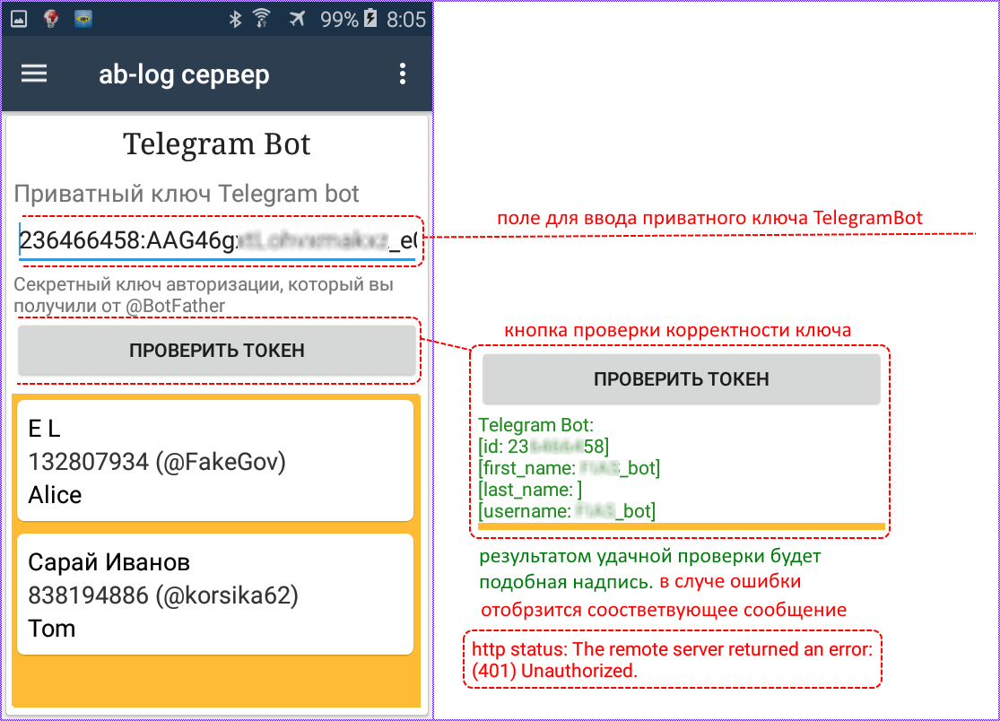
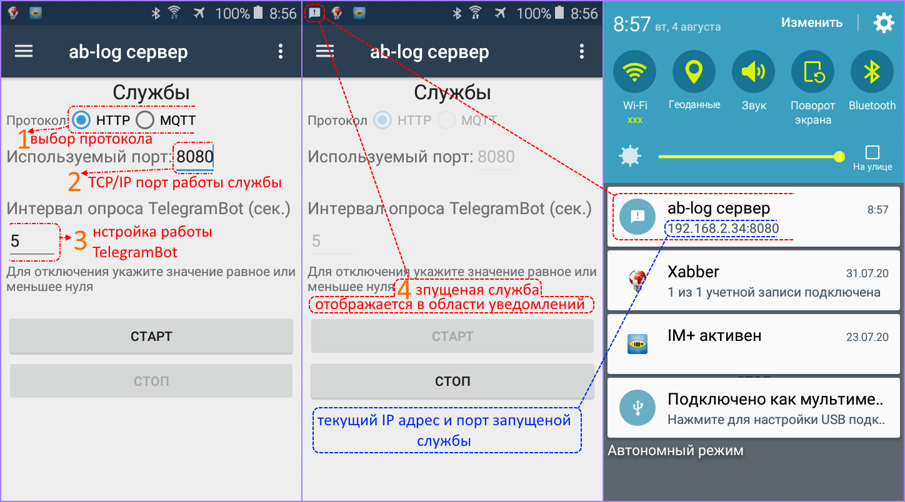
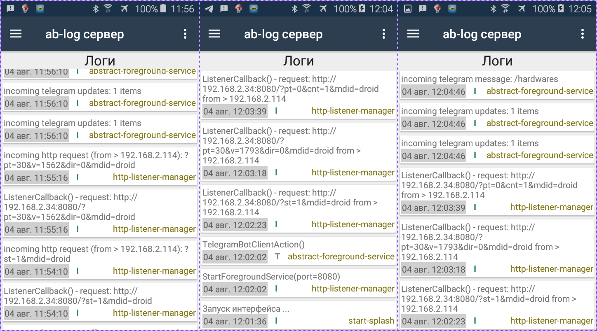

# ab-log-app (beta)
НЕОФИЦИАЛЬНОЕ сервер-приложение управления контроллерами "умного дома" (в т.ч. удалённо через TelegramBot).
По достижении статуса приложения пригодного для массового тестирования - [на форуме](https://ab-log.ru/forum/) производителя контроллеров от [моего имени](https://www.ab-log.ru/forum/search.php?author_id=7152&sr=posts) будет опубликована соответствующая запись.

Текущая версия **beta** - тестирование не окончено. Не рекомендуется для использования ***неопытными*** пользователями и/или для использования в ***реальном управлении*** умным домом.
Следующиая (промежуточная) стадия **RC** (candidate release) будет объявлена после накопления достаточного объёма тестирования.

Приложение возможно использовать в режиме автономного сервреа в т.ч. с функциями удалённого доступа через интернет.

Особенности:
- приложение выступает в роли микро-сервера на базе OS Android. Таким образом любой смартфон с Android версии от 5.0 и выше сможет выполнять роль HTTP/MQTT сервера для обработки вызовов от управляющих контроллеров и обслуживать удалённых клиентов через [Telegram bot api](https://core.telegram.org/bots/api).
- микро-сервер на базе смартфона сразу имеет слот для симки (рассылка уведомлений и получение команд через смс или мобильный интернет), wi-fi и собственный сенсорный дисплей. У подобного сервера есть масса и других преимуществ: низкая цена устройства, встроенный аккумулятор, Bluetooth, микрофон, мобильность и т.д.
- сопряжённое управляющее оборудование используется производителя [ab-log.ru](https://ab-log.ru/)
- ~~хранение настроек (и прочих данных) в облаке. облачное хранилище будет реализовано "поверх почтовых протоколов" (SMTP/POP3/IMAP). Таким образом хранение данных будет бесплатным и доступным любому пользователю. достаточно иметь почтовый ящик. На деле желательно иметь два разных почтовых акаунта на разных серверах (например mail.ru и yandex.ru). Таким образом будет достигаться отказоустойчивость и ап-тайм близкий к 100%.~~
- удалённый доступ к управлению портами, настройками и рассылка уведомлений через SMS/Intenet/TelegramBot. В то время как администратор имеет доступ к низкоуровневой конфигурации сервера и контроллеров, "удалённые пользователи" в зависимости от настроек имеют доступ непосредственно к выходным портами (вкл/выкл оборудования) и/или получение уведомлений от входных портов (датчики) через SMS/Telegram/E-mail. Так же доступен механизм выполнения сценариев (пакетных заданий), с элементами расширенной логики (проверка условия перед выполнением команды и пр.).

 > Специфика обмена данными (команды, ответы, уведомления и т.д.) такова, что в роли транспорта будут использоваться посредники Telegram/Email/SMS.
Это полностью избавляет пользователя от необходимости иметь выделенный IP адрес или аренды хостинга.

Если приложение планируется использовать в кчестве автономного сервера, то в нстройках Android следует исключить его из перечня "оптимизируемых приложений".
Дело в том, что андроид по умолчанию оптимизирует работу всех приложений с целью экономии питания и нагрузки на батарею мобильного устройства.
Одна из особенностей такой оптимизации заключается в том, что приложение, работающее более трёх дней будет остановлено операционной системой (это одна из особенностей андроида).
Что бы избежать такого порведения - следует настроить вашу OS - отключить отпитимизацию для нашего приложения.
Более того - если смартфон станет выполнять роль сервера, то для него следует предусмотреть постоянное подключение к питанию (к зарадному устройству).
Без зарядного устройства смартфон сможет какое-то время работать, но срок автономной работы исчисляется часами и сутками, а системы "умный дом" должны рботать всегда.
Аккамулятор смртфона сослужат хорошую службу на случай отключения света в помещении, но в обычном режиме следует зпитать его от разетки.
В разных версиях Android и в разных производителях смартфонов доступ к настройкам может немного отличаться, но общая логика весьма похожа.
Вот пример настроек для Samsung J1 (2106):

Базы данных. Для хранения данных используется СУБД SQLite. Логи хронятся в отдельной БД. Расположение файлов баз данных можно увидеть при старте приложения:

> некоторые переменные хранятся в **[Xamarin.Essentials: Preferences](https://docs.microsoft.com/en-gb/xamarin/essentials/preferences?tabs=android)**

# Исполнительные контроллеры

Вопервых следует внеси информацию об устройствах. Пункт основного меню: **MegaD-2516**. Этот раздел открывается по умолчанию при запуске приложения.

Ввод/изменение пароля и/или адреса в форме не изменяет настройки самого устройства, а запоминет эти данные для быстрого доступа к ним внутри приложения.
Изменение пароля и адреса устройства (с записью изменения в память самого устройства) доступны в разделе системных настроек.

Системные настройки устройства по сути работа непосредственно с оборудованием. Это оригинальный WEB интерфейс, дополненный визуальными стилями Bootstrap.
На первый взгляд в этом интерфейсе почти нет изменений кроме стилей.

Существует одна особенность поведения формы настроек устройства (IP адрес и пароль).
При изменении в системных настройках - эти изменения втоматически сохрнются в настройках устройствав приложении.

> В связи с тем что у оборудования [отсутвует  программный api](https://ab-log.ru/forum/viewtopic.php?f=5&t=1740), пришлось изобрести костыли для "облагораживания" родного web интерфейса.
Изобретая велосипед использовался подход, при которым оригинальный web/html не столько изменялся, сколько дополнялся. К нему были добавлены скрипты jQuery, Bootstrap и иже с ними. Таким образом надёжность подобного "расширения" имеет минимальные перспективы к серъёзному сбою.
В худшем случае дизайн местами будет проскакивать родной от производителя. Кажду версию прошивки нужно проверять.

Поддержка "продвинутого web интерфейса" доступна толко для проверенных версий прошивки. Для нерповеренных прошивок данное расширение [отключено по умолчанию ~ bool external_web_mode = false;](https://github.com/badhitman/ab-log-app/blob/master/server%20configurator/Activity/HardwareSystemSettingsActivity.cs).
Для прошивок без поддержки расширения интерфейс будет оригинальным от производителя. К исходному HTML управляещего блока будет добавлено только уведомление (native html)

Однако в системных настройках устройства одно важное отличие: Наименование портов. 

В оригинале устройство не имеет возможности задавать имена портам.
В данном же случае такое поле добавлено, но хранится это имя в базе данных приложения, а не в памяти самого устройства.

Это имя будет использоваться в приложении для удобства, но связь этих имён с устройствами хранится в базе данных самого приложения.
Если подменить устройство - подключив его с теми же адресом и паролем, то приложение не заметит этой подмены и будет использовать эти имена для нового устройства.
Равно как переподключение текущего устройств к другому приложению на другом устройстве имена будут утеряны и их прийдётся задавть по новому.

Приложение предоставляет дружелюбный интерфейс для работы с контролерами и позволяет удобно работать одновременно с несколкькими устройствами в одном месте.

## Пользователи

Приложение предусматривает удалённый доступ к серверному устройству Android через интернет.
На текущий момент такой доступ возможен через Telegram клиент. При помощи обычного Telegram клиента можно просматривать состояние портов, включать/выключать их, а так же получать уведомления о срабатывнии датчиков.
Для ввода пользователя и назначении ему прав преднзначен раздел Пользователи (основное меню).

> Для пользователей указывается E-mail и номер сотового телефона для поддержки управления устройством через соответсвующие протоколы, но **указывать их не обязательно**.
На текущий момент удалённый доступ возможен только через TelegramBot, но в дальнейшем начнут функционировать и другие возможности.

## TelegramBot

После ввода пользователей, следует настроить сопряжение с Telegram (пункт вспомогательного меню "TelegramBot").

После того как устройства настроены, пользователи созданы, а ключ TelegramBot введён и проверен - можно переходить к запуску серверных служб (HTTP или MQTT).

## Службы: HTTP, MQTT, TelegramBot

На текущий момент MQTT протокол не желтелен для использования. И дело не в данном приложении, а в том что поддержка самим контроллером днного протокола по срвнению с HTTP не полноценная.
В частности srv-loop в MQTT протоколе невозможно отключить, а то что работет под видом srv-loop не в полне то же самое что в HTTP. Кроме того для MQTT некоторые функции имеют меньшую поддержку контроллером по срвнению с HTTP.
Так же не однократно наблюдал мнение производителя контроллеров, когда они сами рекомендовали выбирть именно протокол HTTP нежели MQTT.
На данный момент MQTT в приложении функцианирует, но его функционал ограничен. Т.е. сам брокер работает исправно, но ни как не регирует на сообщения от устройств.
Брокер позволяет подписаться на топики и отправлять/получать сообщения, но всё это в холостую.
Приложение только пишет информацию в логи. Можно в целях эксперемента попробовать данный протокол и ознкомиться с логами, но для управления умным домом сейчас днный протокол не пригоден.

Сервис исполняется в "Запущеной службе переднего плана".

## Логи программы доступны для просмотра:

TelegramBot

