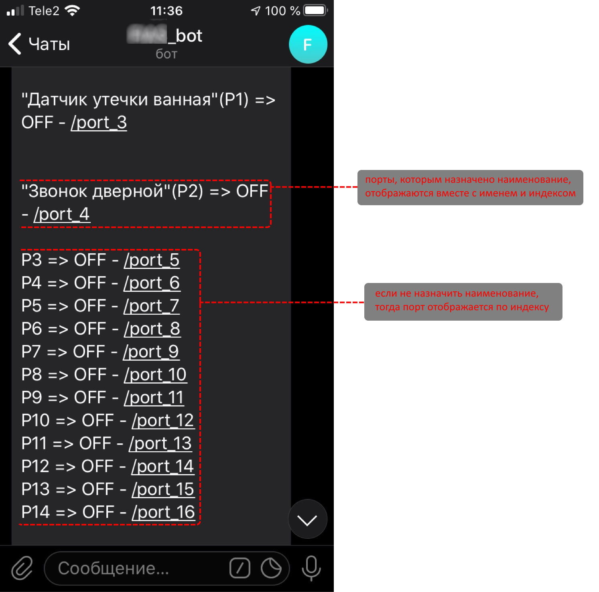

# ab-log-app
НЕОФИЦИАЛЬНОЕ сервер-приложение управления контроллерами "умного дома" (в т.ч. удалённо через TelegramBot).
По достижении статуса приложения пригодного для массового тестирования - [на форуме](https://ab-log.ru/forum/) производителя контроллеров от [моего имени](https://www.ab-log.ru/forum/search.php?author_id=7152&sr=posts) будет опубликована соответствующая запись.

Особенности:
- приложение выступает в роли микро-сервера на базе OS Android. Таким образом любой смартфон с Android версии от 5.0 и выше сможет выполнять роль HTTP/MQTT сервера для обработки вызовов от управляющих контроллеров и обслуживать удалённых клиентов через [Telegram bot api](https://core.telegram.org/bots/api).
- микро-сервер на базе смартфона сразу имеет слот для симки (рассылка уведомлений и получение команд через смс или мобильный интернет), wi-fi и собственный сенсорный дисплей. У подобного сервера есть масса и других преимуществ: низкая цена устройства, встроенный аккумулятор, мобильность и т.д.
- сопряжённое управляющее оборудование используется производителя [ab-log.ru](https://ab-log.ru/)
- ~~хранение настроек (и прочих данных) в облаке. облачное хранилище будет реализовано "поверх почтовых протоколов" (SMTP/POP3/IMAP). Таким образом хранение данных будет бесплатным и доступным любому пользователю. достаточно иметь почтовый ящик. На деле желательно иметь два разных почтовых акаунта на разных серверах (например mail.ru и yandex.ru). Таким образом будет достигаться отказоустойчивость и ап-тайм близкий к 100%.~~
- удалённый доступ к управлению портами, настройками и рассылка уведомлений через SMS/Intenet/TelegramBot. В то время как администратор имеет доступ к низкоуровневой конфигурации сервера и контроллеров, "удалённые пользователи" в зависимости от настроек имеют доступ непосредственно к выходным портами (вкл/выкл оборудования) и/или получение уведомлений от входных портов (датчики) через SMS/Telegram/E-mail. Ни что не мешает "по событию" выполнить дозвон с серверного смартфона на администраторский номер.

 > Специфика обмена данными (команды, ответы, уведомления и т.д.) такова, что в роли транспорта будут использоваться посредники Telegram/Email/SMS.
Это полностью избавляет пользователя от необходимости иметь выделенный IP адрес или аренды хостинга.

## Web

В связи с тем что у оборудования [отсутвует  программный api](https://ab-log.ru/forum/viewtopic.php?f=5&t=1740), пришлось изобрести костыли для "облагораживания" родного web интерфейса.
Изобретая велосипед использовался подход, при которым оригинальный web/html не столько изменялся, сколько дополнялся. К нему были добавлены скрипты jQuery, Bootstrap и иже с ними. Таким образом надёжность подобного "расширения" имеет минимальные перспективы к серъёзному сбою.
В худшем случае дизайн местами будет проскакивать родной от производителя. Кажду версию прошивки нужно проверять.

Конфигурирование портов

Поддержка "продвинутого web интерфейса" доступна толко для проверенных версий прошивки. Для нерповеренных прошивок данное расширение [отключено по умолчанию ~ bool external_web_mode = false;](https://github.com/badhitman/ab-log-app/blob/master/server%20configurator/Activity/HardwareSystemSettingsActivity.cs).
Для прошивок без поддержки расширения интерфейс будет оригинальным от производителя. К исходному HTML управляещего блока будет добавлено только уведомление (native html)

HTTP/MQTT сервис исполняется в "Запущеной службе переднего плана".

TelegramBot

